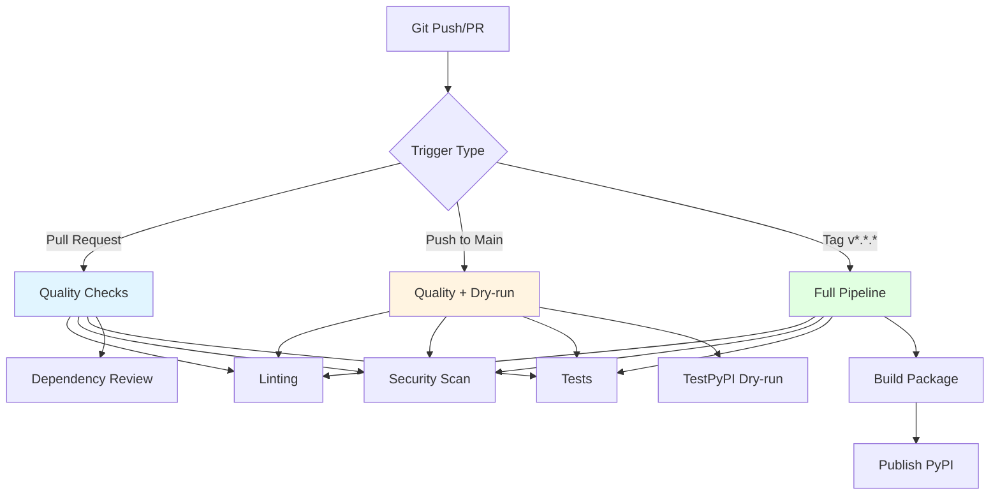

# CI/CD Security & Quality Infrastructure

This document describes the comprehensive security and quality checks integrated into the CI/CD pipeline.

## Overview

The CI/CD pipeline includes multiple layers of automated checks:

1. **Code Quality Checks** - Style, formatting, linting
2. **Security Scanning** - Vulnerability detection, secret scanning
3. **Dependency Management** - Automated updates and audits
4. **Code Coverage** - Test coverage enforcement
5. **Static Analysis** - CodeQL and complexity metrics

## Workflows

### 1. Quality Checks ([.github/workflows/quality-checks.yml](../.github/workflows/quality-checks.yml))

Runs on every PR and push to main/develop.

**Linting & Formatting:**
- ✅ **Black** - Code formatting (PEP 8)
- ✅ **isort** - Import sorting
- ✅ **Flake8** - Style guide enforcement
- ✅ **Pylint** - Static code analysis
- ✅ **MyPy** - Type checking

**Security Scanning:**
- ✅ **Bandit** - Python security linter
- ✅ **Safety** - Dependency vulnerability scanner
- ✅ **pip-audit** - CVE detection in packages
- ✅ **TruffleHog** - Secret scanning (commits & history)

**Code Quality:**
- ✅ **Radon** - Cyclomatic complexity & maintainability index
- ✅ **Vulture** - Dead code detection

**Dependency Review:**
- ✅ **GitHub Dependency Review** - License & vulnerability checks (PRs only)

### 2. CodeQL Analysis ([.github/workflows/codeql.yml](../.github/workflows/codeql.yml))

**Schedule:** Weekly (Mondays at 6 AM UTC)
**Triggers:** Push, PR, manual

- Advanced static application security testing (SAST)
- Finds security vulnerabilities and code quality issues
- GitHub Security tab integration
- Supports 140+ query types

### 3. Publish Package ([.github/workflows/publish-package.yml](../.github/workflows/publish-package.yml))

Enhanced with:
- **Pip caching** - Faster builds
- **Coverage enforcement** - Fails below 40% threshold
- **Coverage artifacts** - HTML reports for analysis
- **Artifact retention** - 30 days

### 4. Version Bump ([.github/workflows/version-bump.yml](../.github/workflows/version-bump.yml))

Automated version management via GitHub UI.

### 5. Dependabot ([.github/dependabot.yml](../.github/dependabot.yml))

**Schedule:** Weekly (Mondays at 9 AM)
**Updates:**
- Python dependencies (grouped by dev/prod)
- GitHub Actions versions
- Auto-assigns reviewers
- Auto-labels PRs

## Local Development

### Pre-Commit Checks

Run before every commit:

```powershell
.\scripts\pre-commit-check.ps1
```

This runs:
- Black (formatting)
- isort (imports)
- Flake8 (style)
- MyPy (types)
- Bandit (security)
- Safety (dependencies)
- Pytest (tests + coverage)

### Individual Tools

```powershell
# Format code
black hub_auth_client/
isort hub_auth_client/

# Linting
flake8 hub_auth_client/ --max-line-length=120

# Type checking
mypy hub_auth_client/ --ignore-missing-imports

# Security scan
bandit -r hub_auth_client/ -ll

# Dependency check
safety check
pip-audit

# Tests with coverage
pytest --cov=hub_auth_client --cov-report=html
# Open htmlcov/index.html to view coverage report
```

## Configuration

### Tool Configuration ([pyproject.toml.security](../pyproject.toml.security))

Merge this into your `pyproject.toml`:

```toml
[tool.black]
line-length = 120
target-version = ['py313']

[tool.isort]
profile = "black"
line_length = 120

[tool.pylint.main]
max-line-length = 120
disable = ["C0111", "C0103", "R0903", "W0212"]

[tool.mypy]
python_version = "3.13"
ignore_missing_imports = true

[tool.bandit]
exclude_dirs = ["/tests", "/migrations"]

[tool.coverage.run]
source = ["hub_auth_client"]
omit = ["*/tests/*", "*/migrations/*"]

[tool.coverage.report]
fail_under = 40
show_missing = true
```

## Security Policy

See [SECURITY.md](../SECURITY.md) for:
- Supported versions
- Vulnerability reporting process
- Security best practices
- HIPAA compliance guidelines

## Quality Gates

### Pull Requests

Must pass:
1. ✅ All linting checks
2. ✅ Security scans (no high/critical issues)
3. ✅ Tests pass
4. ✅ Coverage ≥ 40%
5. ✅ Dependency review (moderate+ severity blocked)
6. ✅ No secrets detected

### Main Branch

After merge:
- Dry-run publish to TestPyPI
- Quality reports uploaded as artifacts
- CodeQL analysis (if scheduled)

### Release (Tags/Releases)

Must pass all PR checks plus:
1. ✅ Package builds successfully
2. ✅ Twine check passes
3. ✅ README_PACKAGE.md exists
4. ✅ Version matches tag

## Metrics & Reporting

### Coverage Reports

- **XML**: For CI parsing
- **HTML**: For detailed analysis
- **Terminal**: For quick feedback
- **Artifacts**: Retained 30 days

Access in GitHub:
- Actions → [Workflow Run] → Artifacts → `coverage-reports`

### Security Reports

Generated artifacts:
- `bandit-report.json` - Security issues
- `safety-report.json` - Dependency vulnerabilities
- `pip-audit-report.json` - CVE details

Access in GitHub:
- Actions → [Workflow Run] → Artifacts → `security-reports`

### CodeQL Results

Access in GitHub:
- Security → Code scanning alerts
- Security → Dependabot alerts

## Best Practices

### Before Committing

1. Run `.\scripts\pre-commit-check.ps1`
2. Fix any reported issues
3. Verify tests pass locally
4. Review coverage report

### During Development

- Write tests for new code
- Add type hints where appropriate
- Follow existing code style
- Document security considerations
- Avoid hardcoded secrets

### Before Release

1. Update `CHANGELOG.md` (if exists)
2. Bump version in both files
3. Run full local checks
4. Review security scan results
5. Verify dependencies are up to date

## Troubleshooting

### "Black found errors"

```powershell
black hub_auth_client/  # Auto-fix formatting
```

### "Import sorting issues"

```powershell
isort hub_auth_client/  # Auto-fix imports
```

### "Flake8 errors"

Review and fix manually - most are code style issues.

### "Bandit found security issues"

- **High/Critical**: Must fix before merging
- **Medium**: Review and fix if valid
- **Low**: Optional, but recommended

### "Safety found vulnerabilities"

```powershell
# Update vulnerable packages
pip install --upgrade <package>

# Or wait for Dependabot PR
```

### "Coverage below threshold"

Add more tests to increase coverage above 40%.

## CI/CD Architecture



## References

- [Black Documentation](https://black.readthedocs.io/)
- [Flake8 Documentation](https://flake8.pycqa.org/)
- [Bandit Documentation](https://bandit.readthedocs.io/)
- [CodeQL Documentation](https://codeql.github.com/docs/)
- [GitHub Actions Security Best Practices](https://docs.github.com/en/actions/security-guides/security-hardening-for-github-actions)
