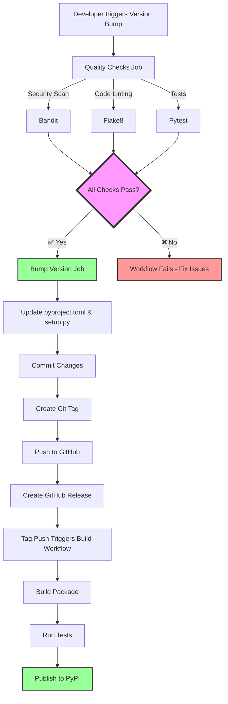

# Integrated CI/CD Workflow

This document describes the integrated quality gates, version bumping, and automated publishing workflow for hub-auth-client.

## 🎯 Workflow Overview



## 📋 Workflow Steps

### 1. Version Bump (Manual Trigger)

**Trigger:** GitHub Actions → Version Bump → Run workflow

**Inputs:**
- Version type: patch|minor|major
- Release description: Optional message

**Quality Gates (Run First):**
1. ✅ **Bandit Security Scan** - No medium/high severity issues
2. ✅ **Flake8 Linting** - Code style compliance
3. ✅ **Pytest Tests** - All tests pass

**If Quality Gates Pass:**
1. Bumps version in `pyproject.toml` and `setup.py`
2. Commits changes
3. Creates git tag (e.g., `v1.0.46`)
4. Pushes to GitHub
5. Creates GitHub Release

**Result:** Tag push automatically triggers "Build and Publish" workflow

### 2. Build & Publish (Automatic)

**Trigger:** Git tag `v*.*.*` is pushed

**Steps:**
1. ✅ Run tests with coverage
2. ✅ Build package (wheel + sdist)
3. ✅ Verify with twine
4. ✅ Publish to PyPI

**Result:** Package available on https://pypi.org/project/hub-auth-client/

## 🔒 Security & Quality Enforcement

### Bandit Security Scan
- **Purpose:** Detect security vulnerabilities
- **Severity Level:** Medium+ issues fail the build
- **Common Checks:**
  - SQL injection risks
  - Hardcoded secrets
  - Unsafe deserialization
  - Missing timeouts on HTTP requests
  - XSS vulnerabilities (with context awareness)

**Note:** Use `# nosec B308,B703` for false positives (e.g., hardcoded HTML in admin badges)

### Flake8 Linting
- **Purpose:** Enforce code style (PEP 8)
- **Configuration:**
  - Max line length: 120
  - Ignored: E203, W503
  - Excluded: migrations, __pycache__

### Pytest Tests
- **Purpose:** Verify functionality
- **Coverage:** Minimum 40% (enforced in publish workflow)
- **Fallback:** If no tests exist, workflow continues with warning

## 🚀 Release Process

### Quick Release (Recommended)
```bash
# 1. Go to GitHub Actions
https://github.com/<your-org>/hub_auth/actions/workflows/version-bump.yml

# 2. Click "Run workflow"
#    - Select version type: patch (bug fixes), minor (features), major (breaking changes)
#    - Add release notes (optional)

# 3. Click "Run workflow" button

# 4. Monitor progress:
#    - Quality checks run (~2 min)
#    - Version bump creates tag (~30 sec)
#    - Build & publish triggers automatically (~3 min)
#    - Package live on PyPI (~5 min total)
```

### Manual Release (If Workflow Fails)
```powershell
cd c:\Users\rparrish\GitHub\micro_service\hub_auth

# 1. Run quality checks locally
py -m bandit -r hub_auth_client/ -ll
py -m flake8 hub_auth_client/ --max-line-length=120
py -m pytest

# 2. Bump version manually
python scripts/bump_version.py patch

# 3. Commit and tag
git add pyproject.toml setup.py
git commit -m "chore: bump version to 1.0.46"
git tag v1.0.46
git push origin main
git push origin v1.0.46
```

## 📊 Workflow Status Checks

### Version Bump Workflow
- **Status:** View in [Actions → Version Bump](../../actions/workflows/version-bump.yml)
- **Duration:** ~3-4 minutes
- **Success Criteria:**
  - All quality checks pass
  - Version files updated
  - Tag created and pushed

### Build & Publish Workflow
- **Status:** View in [Actions → Build and Publish](../../actions/workflows/publish-package.yml)
- **Duration:** ~3-5 minutes
- **Success Criteria:**
  - Package builds successfully
  - Tests pass
  - Published to PyPI

## 🛡️ Quality Gate Bypass (Emergency Only)

If you need to bypass quality checks in an emergency:

1. **Fix the underlying issue** (preferred)
2. **Use manual release** process above
3. **Document WHY** in commit message
4. **Fix quality issues** in next release

**Do NOT:**
- Remove quality checks from workflow
- Push directly without tests
- Skip security scans

## 📝 Version Numbering

Follow [Semantic Versioning](https://semver.org/):

- **PATCH** (1.0.X): Bug fixes, security patches
  - Example: Fixing timeout issues, syntax errors
- **MINOR** (1.X.0): New features, backwards compatible
  - Example: Adding new admin methods, new fields
- **MAJOR** (X.0.0): Breaking changes
  - Example: Removing deprecated APIs, incompatible upgrades

## 🔧 Troubleshooting

### Quality Check Fails
```bash
# Bandit fails
→ Fix security issues or add # nosec with justification

# Flake8 fails
→ Fix code style: black hub_auth_client/ && isort hub_auth_client/

# Tests fail
→ Fix failing tests or update test expectations
```

### Version Bump Fails
```bash
# Git tag already exists
→ Delete tag: git tag -d v1.0.45 && git push origin :refs/tags/v1.0.45

# Permission denied
→ Check repository settings: Settings → Actions → Workflow permissions
```

### Publish Fails
```bash
# Missing PYPI_API_TOKEN
→ Add secret in Settings → Secrets → Actions

# Package already exists
→ Bump version again (can't overwrite PyPI packages)

# Build fails
→ Check README_PACKAGE.md exists and pyproject.toml is valid
```

## 📌 Key Files

| File | Purpose |
|------|---------|
| `.github/workflows/version-bump.yml` | Integrated version bump with quality gates |
| `.github/workflows/publish-package.yml` | Automated build and PyPI publish |
| `.github/workflows/quality-checks.yml` | Standalone quality checks (PRs) |
| `scripts/bump_version.py` | Python script for version bumping |
| `requirements-dev.txt` | Dev dependencies (linters, security tools) |
| `requirements-test.txt` | Test dependencies |

## 🎯 Success Metrics

**Before Integration:**
- Manual version bumping
- No enforced quality checks
- Security issues discovered late

**After Integration:**
- ✅ Automated quality gates
- ✅ One-click releases
- ✅ Security issues caught before release
- ✅ Consistent code quality
- ✅ ~5 minute release cycle

## 🔗 Related Documentation

- [CI_CD_SECURITY.md](CI_CD_SECURITY.md) - Comprehensive security guide
- [RELEASE.md](../RELEASE.md) - Release process documentation
- [SECURITY.md](../SECURITY.md) - Security policy
- [TESTING.md](../../TESTING.md) - Testing standards
